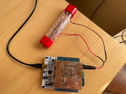

# Geiger counter project

STM32 microcontroller project measuring radioation. Using

- STM32 Nucleo board
- STM X-Nucleo IDB05A2 bluetooth shield
- SBM-20 tube

**NB** using STM submodules, so checkout in `git clone --recursive` fashion.

The hardware is in the Nucleo (Arduino) shield form-factor

Exporting the readings over Blutooth to a Wearable Android client.

[Hardware](./hardware) DipTrace schematics and layout for high-voltage and sensor shield
[Firmware](./firmware) CubeMX + CLion project
[Wearable Client](./client/android) Android Studio project for wearable client

Inspired by [Mighty Ohm Geiger kit](https://mightyohm.com/blog/products/geiger-counter/)
